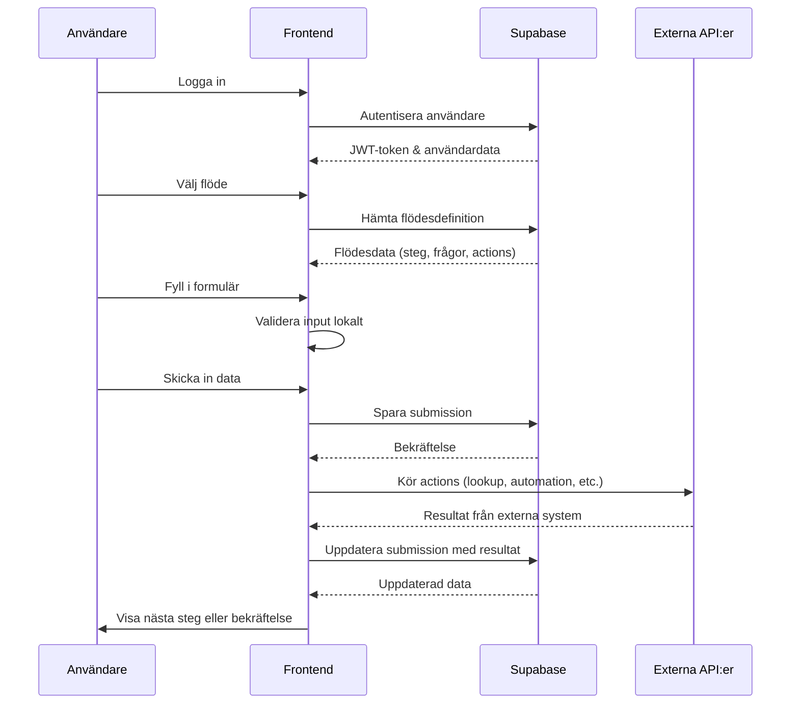
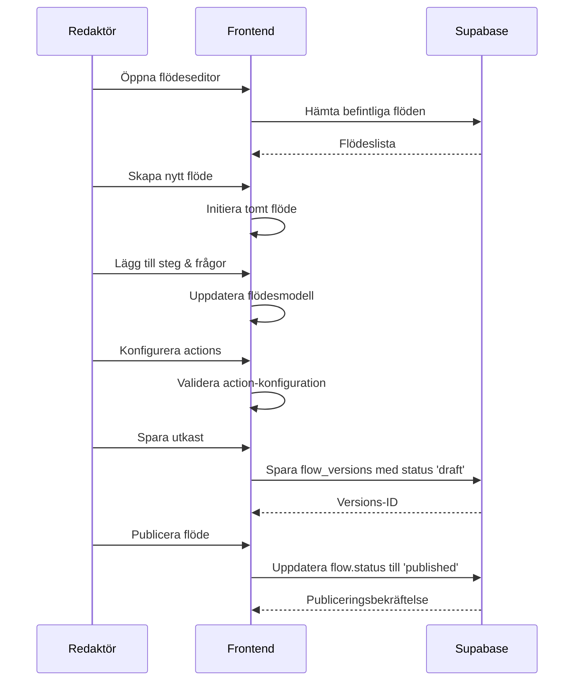
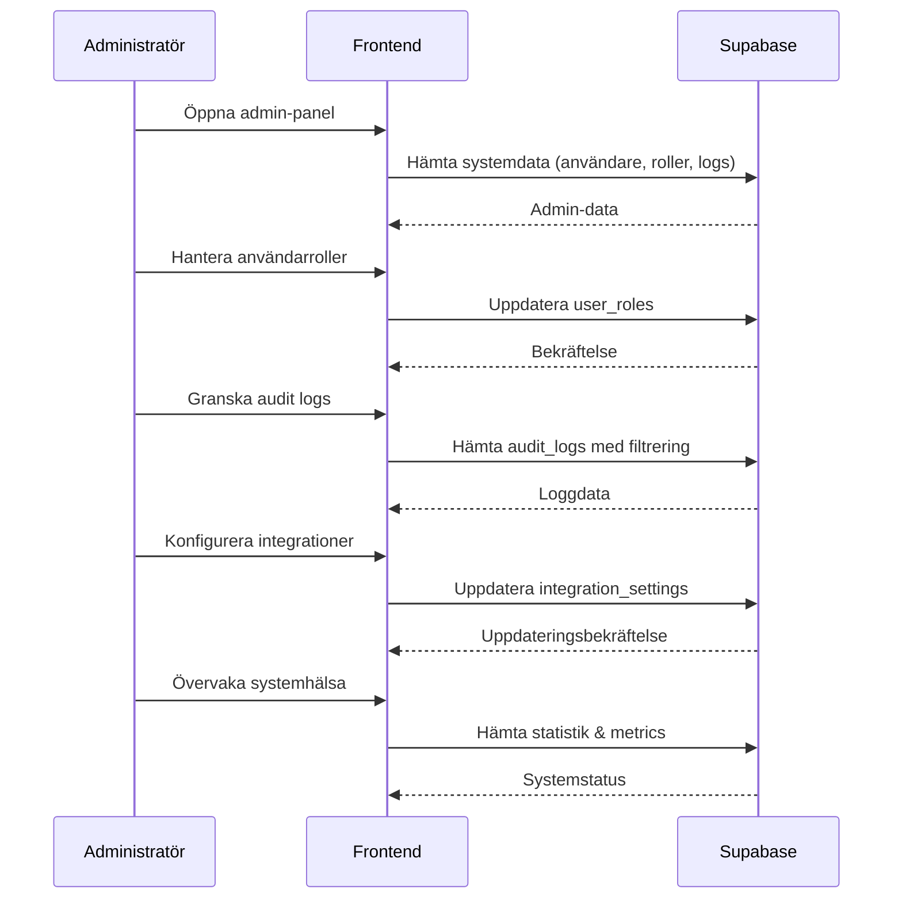
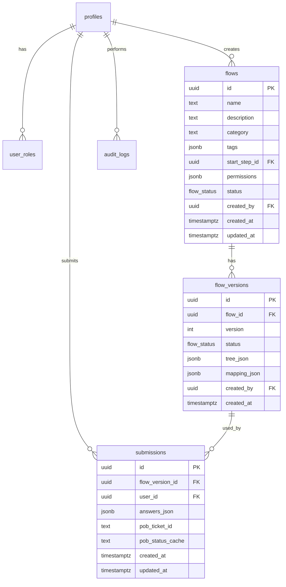
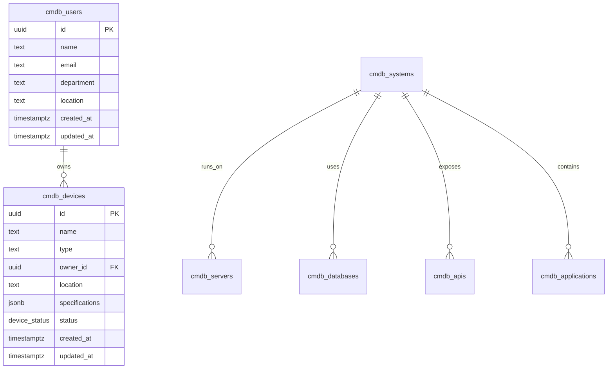
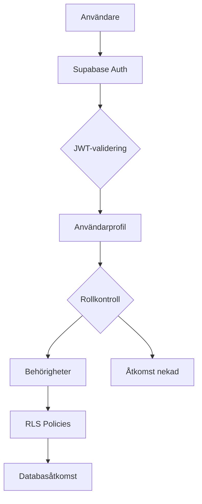
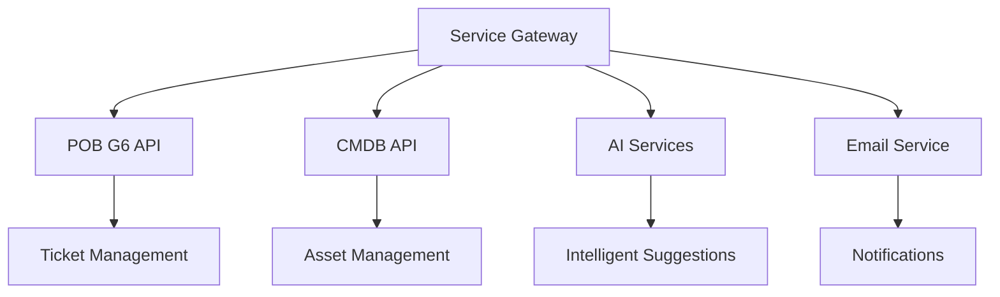
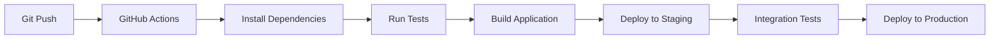

# Systemarkitektur för Service Gateway

Detta dokument beskriver den övergripande arkitekturen för Service Gateway, ett system för ärendehantering och processautomatisering.

## 🏛 Övergripande Arkitektur

Service Gateway är byggt enligt en modern webbapplikationsarkitektur med följande huvudkomponenter:

```
┌─────────────────┐    ┌─────────────────┐    ┌─────────────────┐
│   Frontend      │    │   Backend       │    │   Externa       │
│   (React)       │◄──►│   (Supabase)    │◄──►│   System        │
│                 │    │                 │    │                 │
│ • Flödesbyggare │    │ • PostgreSQL    │    │ • POB G6       │
│ • Ärendehantering│    │ • Auth          │    │ • CMDB         │
│ • CMDB Dashboard│    │ • Real-time     │    │ • AI-tjänster  │
│ • Admin panel   │    │ • Storage       │    │ • E-post        │
└─────────────────┘    └─────────────────┘    └─────────────────┘
```

## 🧩 Komponentdiagram

### Frontend-arkitektur

```
src/
├── components/          # Återanvändbara UI-komponenter
│   ├── ui/             # Shadcn/ui bas-komponenter
│   ├── editor/         # Flödesbyggar-specifika komponenter
│   └── flow/           # Flödeskörningskomponenter
├── contexts/           # Global state management
│   ├── AuthContext.tsx # Användarautentisering & roller
│   └── ...
├── hooks/              # Anpassade React hooks
│   ├── use-flow-builder.ts  # Flödesbyggar-logik
│   ├── use-flow-crud.ts     # CRUD-operationer för flöden
│   ├── use-flow-runtime.ts  # Flödeskörning
│   └── ...
├── lib/                # Hjälpfunktioner & konfigurationer
│   ├── flow-engine/    # Flödesmotor & typer
│   ├── cmdb/          # CMDB-funktionalitet
│   ├── mock-api.ts    # Mock-API för utveckling
│   └── utils.ts       # Hjälpfunktioner
├── pages/              # Sid-routing & layouts
│   ├── admin/         # Administrationssidor
│   ├── editor/        # Flödeseditor
│   └── *.tsx          # Användarsidor
└── integrations/       # Externa API-integrationer
    └── supabase/       # Supabase klient & typer
```

### Backend-arkitektur (Supabase)

```
supabase/
├── migrations/         # Databasscheman & migrationer
├── config.toml         # Supabase konfiguration
└── functions/          # Edge functions (framtida)
```

## 🔄 Dataflöden

### Användarflöde: Skapa och genomföra ett flöde



### Redaktörflöde: Skapa och publicera flöden



### Admin-flöde: Systemadministration



## 💾 Databasmodell

### Huvudentiteter



### CMDB-entiteter



## 🔐 Säkerhetsarkitektur

### Autentisering & Auktorisering



### Row Level Security (RLS)

Alla tabeller har RLS aktiverat med policies baserat på:

- **Ägarskap**: Användare kan endast se/modifiera sina egna data
- **Roller**: Admin, editor, manager, user med olika behörigheter
- **Status**: Published vs draft content
- **Organisation**: Framtida multi-tenant stöd

## ⚡ Prestanda & Skalbarhet

### Optimeringar

1. **Frontend**
   - Code splitting med React.lazy()
   - React Query för intelligent caching
   - Virtualisering för stora listor
   - Optimistic updates

2. **Backend**
   - Database indexes på ofta använda fält
   - Connection pooling
   - Query optimization
   - CDN för statiska tillgångar

3. **API:er**
   - Rate limiting
   - Request batching
   - Response compression
   - Caching headers

### Skalbarhetsstrategier

- **Horisontell skalning**: Stateless frontend, Supabase hanterar skalning
- **Database sharding**: Framtida vid behov
- **CDN**: För global distribution
- **Microservices**: Edge functions för tunga beräkningar

## 🔄 Integrationsarkitektur

### Synkrona Integrationer



### Asynkrona Integrationer

- **Webhooks**: För realtidsuppdateringar
- **Message queues**: För tunga bakgrundsjobb
- **Event streaming**: För audit logging och analytics

## 📊 Övervakning & Observabilitet

### Metrics

- **Applikationsmetrics**: Response times, error rates, användaraktivitet
- **Databasmetrics**: Query performance, connection pools, storage usage
- **Systemmetrics**: CPU, memory, disk I/O

### Logging

- **Application logs**: Frontend errors, API calls
- **Audit logs**: Alla användaråtgärder
- **Integration logs**: Externa API-anrop
- **Security logs**: Autentiseringsförsök, åtkomstkontroll

### Alerting

- **Error thresholds**: Automatiska notifieringar vid fel
- **Performance degradation**: Svarstidsövervakning
- **Security incidents**: Misstänkta aktiviteter

## 🚀 Deployment & DevOps

### Utvecklingsmiljö

```
┌─────────────────┐    ┌─────────────────┐
│   Lokal dev     │    │   GitHub Codespaces │
│   (npm/bun)     │    │   (VS Code)      │
└─────────────────┘    └─────────────────┘
```

### Staging & Produktion

```
┌─────────────────┐    ┌─────────────────┐    ┌─────────────────┐
│   Vercel/Netlify│    │   Supabase       │    │   CDN           │
│   (Frontend)    │    │   (Backend)      │    │   (Assets)      │
└─────────────────┘    └─────────────────┘    └─────────────────┘
```

### CI/CD Pipeline



## 🔮 Framtida Arkitektur

### Planerade Förbättringar

1. **Microservices**
   - Separera flödesmotor till egen tjänst
   - AI-tjänst för intelligenta förslag
   - Notification service för e-post/SMS

2. **Multi-tenant**
   - Organisation-isolering
   - Custom branding per tenant
   - Tenant-specific konfigurationer

3. **Advanced Analytics**
   - Real-time dashboards
   - Machine learning för prediktiv analys
   - Advanced reporting capabilities

4. **Mobile Support**
   - React Native app
   - PWA capabilities
   - Offline support

### Tekniska Skulder

- Migrera från mock-API till riktiga integrationer
- Implementera comprehensive testing
- Add API versioning
- Improve error handling and user feedback

---

Denna arkitektur ger en solid grund för ett skalbart, säkert och användarvänligt system för ärendehantering och processautomatisering.